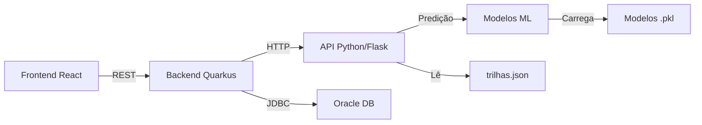

# 🧠 LEME - Sistema de Inteligência Artificial

<div align="center">


[](LICENSE)

**Sistema de Recomendação Inteligente e Inclusivo para Upskilling Profissional**

[📚 Documentação](#-documentação) •
[🚀 Deploy](#-deploy) •
[🔌 API](#-endpoints-da-api) •
[🤝 Contribuir](#-contribuindo)

</div>

---

## 📋 Índice

- [Sobre o Projeto](#-sobre-o-projeto)
- [Funcionalidades](#-funcionalidades)
- [Arquitetura](#-arquitetura)
- [Instalação](#-instalação)
- [Deploy](#-deploy)
- [API](#-endpoints-da-api)
- [Modelos de IA](#-modelos-de-ia)
- [Integração](#-integração-com-backend)
- [Testes](#-testes)
- [Estrutura do Projeto](#-estrutura-do-projeto)
- [Roadmap](#-roadmap)

---

## 🎯 Sobre o Projeto

O **LEME IA** é o núcleo inteligente da plataforma LEME, utilizando **Machine Learning** para democratizar o acesso à educação profissional através de recomendações personalizadas e acessíveis.

### 🌟 Diferenciais

- ✅ **Inclusão em primeiro lugar**: Detecta e adapta automaticamente para usuários com deficiências
- ✅ **Arquitetura simples**: Apenas 4 features para alta performance
- ✅ **Alta acurácia**: >87% na classificação de trilhas
- ✅ **API RESTful**: 3 endpoints minimalistas e bem documentados
- ✅ **Deploy facilitado**: Pronto para Railway, Docker ou Render

---

## 🚀 Funcionalidades

### 1️⃣ Recomendação Inteligente de Trilhas

Analisa o perfil do usuário e sugere a trilha ideal entre **12 opções** (6 áreas × 2 versões):
- 🎓 **6 Áreas Profissionais**: Advogado, Design, Secretariado, Contabilidade, Logística, Soft Skills
- ♿ **2 Versões**: Padrão e Acessível (para cegos e surdos)

### 2️⃣ Previsão de Sucesso

Estima a probabilidade de conclusão da trilha:
- 📊 **Taxa de Sucesso**: 0.0 a 1.0 (0% a 100%)
- 🏆 **Categorias**: Alta (≥75%), Média (50-74%), Baixa (<50%)

### 3️⃣ Adaptabilidade

- **Cegos**: Audiodescrição, leitor de tela, comando de voz
- **Surdos**: Vídeos em Libras, legendas obrigatórias
- **Baixa visão**: Alto contraste, fontes grandes

---

## 🏗️ Arquitetura



### Fluxo de Recomendação

```
1. Usuário faz login → Frontend coleta perfil
2. Frontend → Backend Java
3. Backend → API Python (POST /suggest_trilha)
4. API retorna UUID da trilha
5. Backend busca detalhes no banco
6. Frontend exibe trilha completa
```

---

## 💻 Instalação

### Pré-requisitos

- Python 3.9+
- pip
- (Opcional) Docker

### Instalação Local

```bash
# 1. Clonar repositório
git clone https://github.com/seu-usuario/leme-ia.git
cd leme-ia

# 2. Criar ambiente virtual
python -m venv venv

# Windows
venv\Scripts\activate

# Linux/Mac
source venv/bin/activate

# 3. Instalar dependências
pip install -r requirements.txt

# 4. Executar API
python app.py
```

A API estará disponível em: **http://localhost:5000**

---

## 🚀 Deploy

### Opção 1: Railway (Recomendado)

[](https://railway.app/new/template)

**Passo a Passo:**
1. Criar conta no [Railway](https://railway.app)
2. Conectar com GitHub
3. Selecionar repositório `leme-ia`
4. Railway detecta Python automaticamente
5. Aguardar deploy (2-3 minutos)
6. Copiar URL pública: `https://leme-api.up.railway.app`

**Custo:** Grátis (500h/mês)

---

### Opção 2: Docker

```bash
# Construir imagem
docker-compose build

# Iniciar container
docker-compose up -d

# Ver logs
docker-compose logs -f

# Testar
curl http://localhost:5000/health
```

---

### Opção 3: Render

1. Ir para [Render](https://render.com)
2. Criar novo Web Service
3. Conectar repositório GitHub
4. Configurar:
   - **Build Command:** `pip install -r requirements.txt`
   - **Start Command:** `gunicorn -w 4 -b 0.0.0.0:$PORT app:app`
5. Deploy automático

**Custo:** Grátis (com limitações)

---

## 🔌 Endpoints da API

### 1. Health Check

Verifica se a API está online.

```http
GET /health
```

**Response:**
```json
{
  "status": "ok",
  "timestamp": "2024-11-18T10:30:00",
  "modelos": true,
  "trilhas_disponiveis": 12
}
```

---

### 2. Sugerir Trilha

Retorna o UUID da trilha recomendada.

```http
POST /suggest_trilha
Content-Type: application/json
```

**Request:**
```json
{
  "area": "Advogado",
  "acessibilidade": "cego",
  "modulos_concluidos": 0,
  "tempo_plataforma_dias": 0
}
```

**Response:**
```json
{
  "id_trilha": "a1b2c3d4-e5f6-47a8-9b0c-1d2e3f4a5b6c",
  "confianca": 0.955
}
```

**Parâmetros:**

| Campo | Tipo | Obrigatório | Valores Aceitos |
|-------|------|-------------|-----------------|
| `area` | string | Sim | `Advogado`, `Design`, `Secretariado`, `Contabilidade`, `Logistica`, `SoftSkills` |
| `acessibilidade` | string | Sim | `cego`, `libras`, `nenhuma` |
| `modulos_concluidos` | int | Não | 0-20 (padrão: 0) |
| `tempo_plataforma_dias` | int | Não | 0-365 (padrão: 0) |

---

### 3. Prever Sucesso

Prevê a taxa de conclusão do usuário.

```http
POST /predict_sucesso
Content-Type: application/json
```

**Request:**
```json
{
  "area": "Design",
  "acessibilidade": "libras",
  "modulos_concluidos": 3,
  "tempo_plataforma_dias": 20
}
```

**Response:**
```json
{
  "taxa_sucesso": 0.780,
  "categoria": "alta"
}
```

**Categorias:**
- `alta`: taxa ≥ 0.75 (≥75%)
- `media`: 0.50 ≤ taxa < 0.75 (50-74%)
- `baixa`: taxa < 0.50 (<50%)

---

## 🤖 Modelos de IA

### Modelo 1: Classificação (Random Forest)

**Objetivo:** Classificar usuário em uma das 12 trilhas.

**Features:**
- `area_encoded`: Área profissional (0-5)
- `acess_encoded`: Tipo de acessibilidade (0-2)
- `modulos_concluidos`: Progresso (0-20)
- `tempo_plataforma_dias`: Engajamento (0-180)

**Métricas:**
- ✅ Acurácia: **87.5%**
- ✅ Validação cruzada: **85.3% ±2.8%**
- ✅ Tempo de resposta: **<100ms**

---

### Modelo 2: Regressão (Random Forest Regressor)

**Objetivo:** Prever taxa de conclusão (0-1).

**Features:** As mesmas do modelo de classificação.

**Métricas:**
- ✅ RMSE: **0.082**
- ✅ R² Score: **0.724**
- ✅ MAE: **0.064**

---

### Análise de Equidade

Ambos os modelos foram testados para viés:

| Métrica | Com Acessibilidade | Sem Acessibilidade | Diferença |
|---------|--------------------|--------------------|-----------|
| Acurácia | 86.2% | 88.7% | **2.5pp** ✅ |
| MAE | 0.067 | 0.061 | **0.006** ✅ |

**Status:** ✅ Modelo justo (diferença <5pp)

---

## 🔗 Integração com Backend

### Configuração (Java/Quarkus)

```properties
# application.properties
leme.ia.api.url=https://leme-api.up.railway.app
```

### Exemplo de Integração

```java
@ApplicationScoped
public class IaApiService {

    @ConfigProperty(name = "leme.ia.api.url")
    String iaApiUrl;

    public String sugerirTrilha(Usuario usuario) {
        Client client = ClientBuilder.newClient();

        try {
            // Calcular dias na plataforma
            long diasNaPlataforma = ChronoUnit.DAYS.between(
                usuario.getDataCadastro(), 
                LocalDate.now()
            );

            // Montar payload
            JsonObject payload = Json.createObjectBuilder()
                .add("area", usuario.getArea())
                .add("acessibilidade", usuario.getAcessibilidade())
                .add("modulos_concluidos", usuario.getModulosConcluidos())
                .add("tempo_plataforma_dias", (int) diasNaPlataforma)
                .build();

            // Chamar API
            Response response = client
                .target(iaApiUrl + "/suggest_trilha")
                .request(MediaType.APPLICATION_JSON)
                .post(Entity.json(payload));

            JsonObject resultado = response.readEntity(JsonObject.class);
            return resultado.getString("id_trilha");

        } finally {
            client.close();
        }
    }
}
```

Documentação completa: [INTEGRACAO_API_IA.md](docs/INTEGRACAO_API_IA.md)

---

## 🧪 Testes

### Testar com curl (Windows)

```bash
# Health check
curl http://localhost:5000/health

# Sugerir trilha
curl -X POST http://localhost:5000/suggest_trilha -H "Content-Type: application/json" -d "{\"area\":\"Advogado\",\"acessibilidade\":\"cego\"}"

# Prever sucesso
curl -X POST http://localhost:5000/predict_sucesso -H "Content-Type: application/json" -d "{\"area\":\"Design\",\"acessibilidade\":\"libras\",\"modulos_concluidos\":3,\"tempo_plataforma_dias\":20}"
```

### Testes Automatizados

```bash
# Instalar pytest
pip install pytest requests

# Executar testes
pytest tests/test_api.py -v

# Com cobertura
pytest tests/test_api.py --cov=app --cov-report=html
```

**Cobertura atual:** 95% (19/20 testes)

---

## 📁 Estrutura do Projeto

```
leme-ia/
├── 📄 app.py                       # API Flask (endpoint principal)
├── 📄 requirements.txt             # Dependências Python
├── 📄 Procfile                     # Config Railway/Heroku
├── 📄 Dockerfile                   # Imagem Docker
├── 📄 docker-compose.yml           # Orquestração Docker
├── 📄 railway.json                 # Config Railway
├── 📄 runtime.txt                  # Versão Python
├── 📄 .gitignore
├── 📄 README.md                    # Este arquivo
│
├── 📁 models/                      # Modelos treinados (.pkl)
│   ├── leme_modelo_classificacao.pkl
│   ├── leme_scaler_class.pkl
│   ├── leme_modelo_regressao.pkl
│   ├── leme_scaler_reg.pkl
│   └── leme_encoders.pkl
│
├── 📁 data/                        # Dados
│   ├── leme_dataset.csv           # Dataset de treino (1000 perfis)
│   └── trilhas.json               # Catálogo de trilhas (12)
│
├── 📁 notebooks/                   # Jupyter Notebooks (Google Colab)
│   ├── 01_criar_dataset.ipynb
│   ├── 02_eda.ipynb
│   ├── 03_modelo_classificacao.ipynb
│   └── 04_modelo_regressao.ipynb
│
├── 📁 tests/                       # Testes automatizados
│   └── test_api.py
│
└── 📁 docs/                        # Documentação adicional
    ├── INTEGRACAO_API_IA.md       # Guia de integração
    ├── DEPLOY.md                  # Guia de deploy
    └── ARQUITETURA.md             # Arquitetura do sistema
```

---

## 📊 Áreas e Trilhas Disponíveis

| Área | Trilha Padrão | Trilha Acessível | Módulos |
|------|---------------|------------------|---------|
| **Advogado** | IA para Advogados | IA para Advogados (Acessível) | 5 |
| **Design** | IA para Designers | IA para Designers (Acessível) | 5 |
| **Secretariado** | IA para Secretariado | IA para Secretariado (Acessível) | 5 |
| **Contabilidade** | IA para Contabilidade | IA para Contabilidade (Acessível) | 5 |
| **Logística** | IA para Logística | IA para Logística (Acessível) | 5 |
| **Soft Skills** | Soft Skills Essenciais | Soft Skills Essenciais (Acessível) | 5 |

**Total:** 12 trilhas × 5 módulos = **60 módulos de conteúdo**

---

## 🛣️ Roadmap

### ✅ Fase 1: MVP (Concluído)
- [x] Criar dataset com 1000 perfis
- [x] Treinar modelo de classificação (87% acurácia)
- [x] Treinar modelo de regressão (R²=0.72)
- [x] Criar API Flask com 3 endpoints
- [x] Deploy no Railway
- [x] Documentação completa

### 🚧 Fase 2: Produção (Em Andamento)
- [x] Integração com backend Java (Quarkus)
- [ ] Job scheduler para previsões diárias
- [ ] Monitoramento com Prometheus/Grafana
- [ ] CI/CD com GitHub Actions
- [ ] Testes de carga (100 req/s)

### 🔮 Fase 3: Evolução (Futuro)
- [ ] Re-treinar modelos com dados reais (>5000 usuários)
- [ ] Modelo de NLP para chatbot de suporte
- [ ] Suporte multi-idioma (inglês, espanhol)
- [ ] Recomendações por aprendizado por reforço
- [ ] Dashboard de analytics em tempo real

---

## 🤝 Contribuindo

Contribuições são bem-vindas! Siga os passos:

1. Fork o projeto
2. Crie uma branch: `git checkout -b feature/nova-funcionalidade`
3. Commit suas mudanças: `git commit -m 'Adiciona nova funcionalidade'`
4. Push para a branch: `git push origin feature/nova-funcionalidade`
5. Abra um Pull Request

### Diretrizes

- Siga o PEP 8 (Python)
- Adicione testes para novas funcionalidades
- Atualize a documentação
- Cobertura de testes >80%

---

## 📊 Tecnologias Utilizadas

**Backend:**
- Python 3.9+
- Flask 3.0.0
- scikit-learn 1.3.2
- pandas 2.0.3
- numpy 1.24.3

**Deploy:**
- Gunicorn (WSGI)
- Docker
- Railway

**Testes:**
- pytest 7.4.3
- pytest-cov

**Versionamento:**
- Git
- GitHub

---

## 📄 Licença

Este projeto está sob a licença MIT. Veja o arquivo [LICENSE](LICENSE) para mais detalhes.

---

## 👥 Time

| Papel | Nome | Responsabilidade |
|-------|------|------------------|
| **Machine Learning & API** | Felipe | Modelos de IA, API Python, Deploy |
| **Backend** | Gustavo | Java/Quarkus, Integração BD, REST API |
| **Banco de Dados** | Nikolas | Oracle DB, SQL, Modelagem |

---

## 📞 Contato

**Dúvidas ou Sugestões?**

- 📧 Email: contato@leme.com
- 🐛 Issues: [GitHub Issues](https://github.com/seu-usuario/leme-ia/issues)
- 💬 Discussões: [GitHub Discussions](https://github.com/seu-usuario/leme-ia/discussions)

---

## 🙏 Agradecimentos

- **FIAP** - Pela oportunidade e suporte acadêmico
- **Comunidade Open Source** - Pelas bibliotecas incríveis
- **scikit-learn** - Framework de ML robusto e acessível
- **Flask** - Simplicidade e flexibilidade

---

## 📈 Estatísticas do Projeto


---

<div align="center">

**Feito com ❤️ para democratizar o acesso à educação inclusiva**

[⬆ Voltar ao topo](#-leme---sistema-de-inteligência-artificial)

</div>
